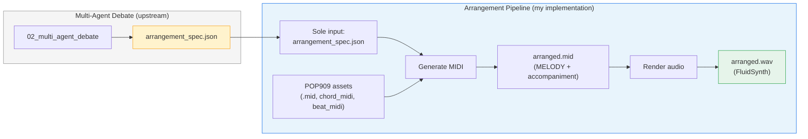
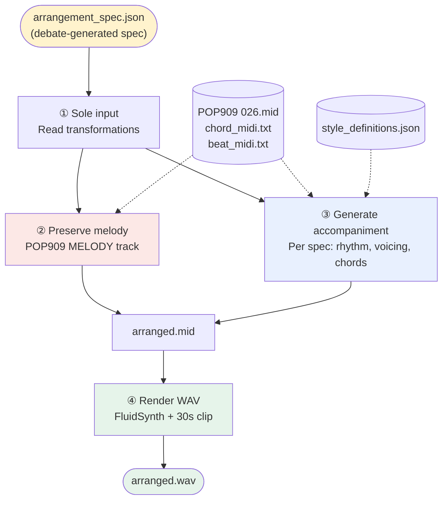
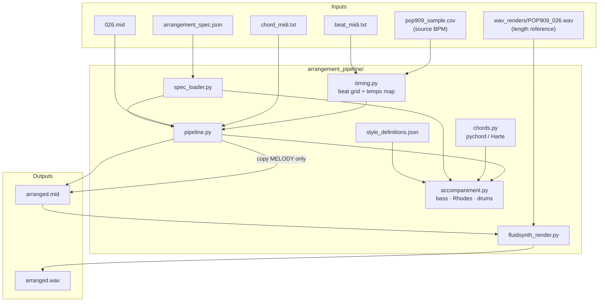
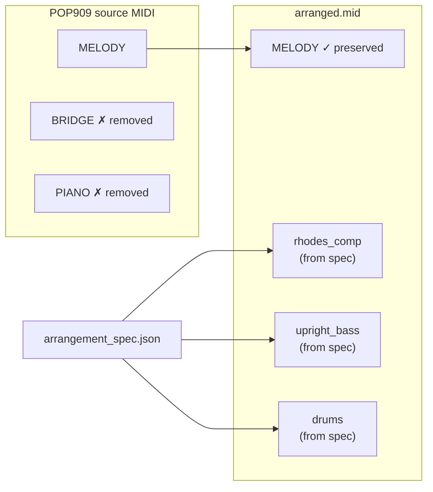

# Arrangement Pipeline — Diagrams (English, for PPT)

Copy diagrams into [mermaid.live](https://mermaid.live) → Export PNG → Insert into Google Slides.

---

## 1. High-level (one slide)

---

## 2. Primary responsibilities (one slide)

---

## 3. Internal modules (technical slide)

---

## 4. MIDI track layout (optional slide)

---

## 5. Caption text for PPT (copy-paste)

**Title:** Arrangement Pipeline Overview

**Subtitle:** From debate specification to playable audio

**Bullets:**
- **Input:** `arrangement_spec.json` only (from Multi-Agent Debate)
- **Preserve:** Original MELODY from POP909 MIDI
- **Generate:** Accompaniment MIDI (Rhodes, upright bass, drums) per spec
- **Render:** `arranged.wav` via FluidSynth (30s, aligned with CLAP reference clip)

**Not used for rendering:** `debate_log.json`, `natural_language_summary`
