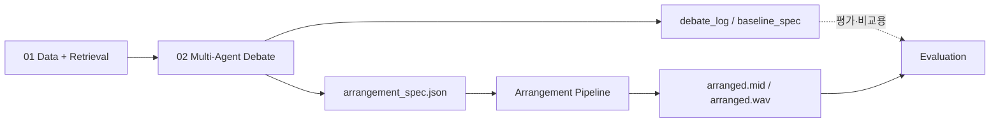
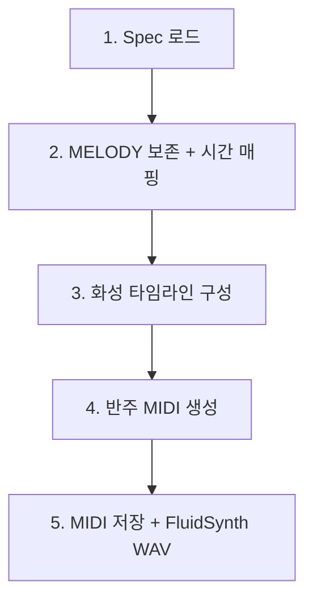

# Arrangement Pipeline — 발표용 슬라이드 초안

> MusicPlaybook: [github.com/gyeongchan02/MusicPlaybook](https://github.com/gyeongchan02/MusicPlaybook)  
> 담당: Audio / Arrangement (JSON spec → MIDI → WAV)  
> 데모: `outputs/run_20260528_173722_POP909_026_lo-fi_chill/`

---

## Slide 1 — 타이틀

**MusicPlaybook Arrangement Pipeline**

- Multi-Agent Debate가 만든 `arrangement_spec.json`을 **실제 들을 수 있는 편곡**으로 변환
- POP909 원곡 MELODY 보존 + lo-fi chill 반주 자동 생성
- 2026-1 Proj4DS Team 6

---

## Slide 2 — 팀 파이프라인에서의 위치



| 레이어 | 산출물 | 본 파이프라인 사용 |
|--------|--------|-------------------|
| Debate | `arrangement_spec.json` | ✅ **유일 입력** |
| Debate | `debate_log.json`, `baseline_spec.json` | ❌ 렌더 미사용 |
| Data | POP909 MIDI, chord/beat txt, wav_renders | ✅ |

**한 줄:** Debate는 “무엇을 할지” 정하고, Arrangement Pipeline은 “실제로 연주”한다.

---

## Slide 3 — 구현 목표 (Requirements)

1. POP909 원본 MIDI 로드  
2. **MELODY 트랙만 보존** (BRIDGE / PIANO 제거)  
3. Harte 코드 심볼 파싱 (`G:sus2`, `A:min`, …)  
4. Spec 기반 반주: `lofi_swung_16th`, `spread_with_9ths`, `texture_density ∈ [0,1]`  
5. **Upright bass** + **Rhodes comp** (+ optional lofi drums)  
6. `arranged.mid` / `arranged.wav` (FluidSynth)  
7. 원본 CLAP 클립과 **동일 30초** (`data/wav_renders/*.wav`)  
8. **모듈형:** 스타일 확장은 `style_definitions.json`만 수정  

---

## Slide 4 — 기술 스택

| 구분 | 라이브러리 / 도구 |
|------|-------------------|
| MIDI I/O | `pretty_midi` |
| 화성 이론 | `music21` (fallback), **`pychord`** (주) |
| 오디오 | **FluidSynth** CLI + `soundfile` |
| 스펙 | JSON (`arrangement_spec.json`) |
| 스타일 엔진 | `style_definitions.json` (코드 분리) |

---

## Slide 5 — 폴더 구조 (모듈 설계)

```
arrangement_pipeline/
├── pipeline.py          # 오케스트레이션
├── spec_loader.py       # JSON → transformations
├── pop909.py              # MELODY / chord / beat I/O
├── timing.py              # 비트 그리드 + 템포 매핑  ★
├── chords.py              # Harte → pitch (pychord)
├── accompaniment.py       # bass / rhodes / drums
├── voicing.py + rhythm.py # 스타일 엔진 헬퍼
├── style_registry.py      # JSON lookup
├── style_definitions.json # ★ 스타일만 여기서 확장
├── fluidsynth_render.py   # WAV 렌더 + 30초 맞춤
└── run.py                 # CLI 진입점
```

**설계 원칙:** Python은 “엔진”, 스타일 파라미터는 JSON.

---

## Slide 6 — 입력 / 출력

**입력**

| 파일 | 역할 |
|------|------|
| `arrangement_spec.json` | tempo, rhythm, voicing, density, chord_progression |
| `026.mid` | MELODY 추출 |
| `chord_midi.txt` | 마디별 화성 (기본) |
| `beat_midi.txt` | 다운비트·쿼터 비트 정렬 ★ |
| `artifacts/pop909_sample.csv` | 원곡 BPM (80) |
| `data/wav_renders/POP909_026.wav` | 출력 길이 기준 (30s) |

**출력**

- `arranged.mid` — 전곡 길이 편곡  
- `arranged.wav` — 앞 30초, FluidSynth, 참조 wav와 동일 sample 수  

---

## Slide 7 — `arrangement_spec.json`에서 읽는 필드

**사용 ✅**

```json
"transformations": {
  "tempo_bpm": 76,
  "rhythm_pattern": "lofi_swung_16th",
  "voicing_style": "spread_with_9ths",
  "texture_density": 0.45,
  "chord_progression": [ {"bar": 1, "chord": "G:sus2"}, ... ],
  "instrumentation": { "lead": "rhodes_electric_piano", "bass": "upright_bass", ... }
}
```

**미사용 ❌**

- `natural_language_summary` (LLM 설명문)  
- `debate_log.json` (토론 기록)  
- `instrumentation.ambient` (vinyl_crackle — 미구현)  

---

## Slide 8 — 처리 흐름 (5단계)



1. **Spec 로드** — `transformations` 추출 (converged / primary_spec)  
2. **멜로디** — POP909 MELODY만 복사, `beat_midi` + 메타 BPM으로 시간 스케일  
3. **화성** — `chord_midi.txt` + spec `chord_progression` override  
4. **반주** — style JSON → Rhodes voicing + bass + drums  
5. **렌더** — FluidSynth → 30초 trim/pad  

---

## Slide 9 — 멜로디 보존 & 타이밍 (핵심 구현)

**문제 (초기 버전)**  
- `pretty_midi.estimate_tempo()` ≈ 150 BPM 오류 → 멜로디만 찌그러짐  
- 반주는 t=0, 멜로디는 t≈16s → **엇박자**

**해결 (`timing.py`)**  
- 원곡 BPM: `pop909_sample.csv` (**80 BPM**)  
- 다운비트: `beat_midi.txt` **3번째 열 = 1.0** (마디 1박)  
- 멜로디: 첫 다운비트 기준 `(76/80)` 스케일  
- 반주: POP909 **실제 비트 시각**에 16분 스윙 그리드  

---

## Slide 10 — 코드 심볼 파싱 (`chords.py`)

POP909 Harte 표기 → `pychord`:

| Harte | pychord |
|-------|---------|
| `G:sus2` | `Gsus2` |
| `A:min` | `Am` |
| `D:maj` | `D` |

→ `spread_with_9ths` voicing으로 MIDI pitch 생성 (9th optional)

---

## Slide 11 — 스타일 엔진 (`style_definitions.json`)

**예: lo-fi chill (debate spec과 1:1 enum)**

| 필드 | 값 | 효과 |
|------|-----|------|
| `rhythm_pattern` | `lofi_swung_16th` | 스윙 16분, kick/snare/hat 패턴 |
| `voicing_style` | `spread_with_9ths` | 넓은 Rhodes voicing + 9th |
| `texture_density` | `0.45` | comp 밀도 45% |

**확장 방법:** JSON에 `rhythm_patterns` / `voicing_styles` 항목 추가 → **Python 수정 없음**

---

## Slide 12 — 트랙 구성 (데모 결과)

| 트랙 | 내용 |
|------|------|
| MELODY | 원곡 멜로디 (음정·프레이즈 유지) |
| rhodes_comp | 화성 comp |
| upright_bass | 루트 베이스 |
| drums | lofi brushed (kick/snare/hat) |

---

## Slide 13 — 실행 방법 (데모)

```bash
cd MusicPlaybook
pip install -r arrangement_pipeline/requirements.txt
brew install fluid-synth

python3.10 -m arrangement_pipeline.run \
  --spec outputs/run_.../arrangement_spec.json \
  --out-dir outputs/run_.../arranged \
  -v   # 어떤 설정이 반영됐는지 출력
```

---

## Slide 14 — Before / After (발표 스토리)

| | Before (초기) | After (현재) |
|--|---------------|--------------|
| 템포 | estimate ~150 | CSV 메타 80 BPM |
| 비트 | 0초 = 1마디 | `beat_midi` 다운비트 |
| 멜로디·반주 | 다른 그리드 | 동일 비트 그리드 |
| WAV | sine fallback 가능 | FluidSynth + 30s 정합 |

**시연:** `arranged.wav` vs `data/wav_renders/POP909_026.wav` (길이 동일)  

---

## Slide 15 — 한계 & 향후

| 한계 | 향후 |
|------|------|
| vinyl_crackle 미구현 | ambient 트랙 |
| 30초만 WAV (CLAP 정책) | full-length export 옵션 |
| spec bar vs pickup 구간 | 반주 시작 = 첫 화성 시점 |
| 단일 스타일 엔진 | jazz / cinematic JSON 추가 |

---

## Slide 16 — 요약 (발표 마무리)

- Multi-Agent **`arrangement_spec.json` → 실행 가능한 MIDI/WAV** 브릿지 구현  
- **모듈형 JSON 스타일** + POP909 **beat/chord 정합**으로 엇박자 문제 해결  
- 팀 데모: **POP909_026 lo-fi chill** (`arranged.mid` / `arranged.wav`)  
- Repo: [github.com/gyeongchan02/MusicPlaybook](https://github.com/gyeongchan02/MusicPlaybook) / `arrangement_pipeline/`

---

## 발표자 메모 (30초 엘리베이터)

> “저는 debate가 뽑은 JSON 스펙을 받아서, POP909 멜로디는 그대로 두고 lo-fi 반주를 MIDI로 생성합니다.  
> 비트 파일이랑 메타 BPM으로 그리드를 맞추고, FluidSynth로 30초 wav까지 뽑았습니다.  
> 스타일은 JSON만 바꾸면 되게 모듈로 나눴습니다.”

---

## PPT 제작 팁

- Slide 2, 8: mermaid → [mermaid.live](https://mermaid.live) 에서 PNG export  
- Slide 12: `arranged.wav` / waveform 캡처  
- Slide 14: `-v` 터미널 출력 스크린샷  
- 코드 슬라이드: `pipeline.py` 80–120줄, `timing.py` `parse_beat_file` 일부  
